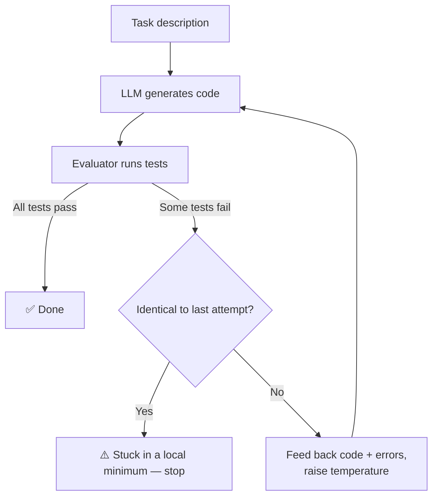

# 🔁 Recursive Code Improver (RSI)


A small local **Recursive Self-Improvement** loop: an LLM writes a Python function for a task, an evaluator runs it against test cases, and — if it fails — the LLM gets its own broken code and the exact error messages back, and tries again. No cloud API, no fine-tuning: just a local model, a feedback loop, and enough tries.

## How it works



Each failed attempt feeds the previous code and the failing test messages back into the next prompt. The sampling temperature climbs with every retry (`0.2 → 0.35 → 0.5 → …`, capped at `0.9`) to help the model escape a wrong-but-stable answer instead of regenerating the exact same bug forever. If it ever produces byte-identical code twice in a row, the loop stops early rather than burning through the remaining attempts for nothing.

## Features

- **Local-first** — talks to any OpenAI-compatible local server (built and tested against [LM Studio](https://lmstudio.ai/) running `qwen2.5-coder-7b-instruct`).
- **Feedback-driven retries** — failed attempts aren't wasted; the exact error is what the next prompt is built from.
- **Escalating temperature** — avoids the model looping on its own wrong answer forever.
- **Stagnation detection** — stops as soon as retries stop producing anything new.
- **Dynamic task loading** — `loop.py` only imports the one task you select at runtime (`importlib`), so you can add or delete task files freely without touching the loop itself.

## Project structure

```
recursive-code-improver/
├── .gitignore
├── requirements.txt
└── src/
    ├── loop.py                  # orchestrates the generate → evaluate → retry cycle
    ├── generator/
    │   └── llm_generator.py     # builds the prompt, calls the local LLM
    ├── evaluator/
    │   └── evaluator.py         # runs the generated function against test cases
    └── tasks/
        ├── sum_list.py
        ├── run_length_encode.py
        ├── is_balanced_brackets.py
        ├── wildcard_match.py
        └── format_number.py
```

## Setup

1. **Install dependencies**
   ```bash
   pip install -r requirements.txt
   ```
2. **Start a local LLM server** — in [LM Studio](https://lmstudio.ai/), load `qwen2.5-coder-7b-instruct` (or any other OpenAI-API-compatible model) and start the local server on `http://localhost:1234/v1`.
3. **Run it**
   ```bash
   cd src
   python loop.py
   ```

## Usage

Open `src/loop.py` and pick a task by name:

```python
CURRENT_TASK_NAME = "format_number"
# CURRENT_TASK_NAME = "wildcard_match"
# CURRENT_TASK_NAME = "is_balanced_brackets"
# CURRENT_TASK_NAME = "run_length_encode"
# CURRENT_TASK_NAME = "sum_list"

MAX_ITERATIONS = 10
```

Only the selected task's file is ever imported, so the other task files in `tasks/` don't need to exist for the script to run.

## Adding a new task

Create `tasks/<your_task_name>.py`:

```python
TASK = {
    "name": "your_task_name",
    "description": "Natural-language description of the function to write — this is exactly what gets sent to the model.",
    "tests": [
        {"input": ..., "expected": ...},
        {"input": ..., "expected": ...},
    ],
}
```

The evaluator grabs the first callable the generated code defines and calls it as `func(test["input"])` — so for multi-argument problems, pack the arguments into a tuple or dict and unpack them inside the generated function (see `wildcard_match.py` for an example).

## Included tasks

| Task | Difficulty | Why it's here |
|---|---|---|
| `sum_list` | Easy | Sanity check that the pipeline works end to end |
| `run_length_encode` | Medium | Classic off-by-one trap (forgetting to flush the last run) |
| `is_balanced_brackets` | Medium–Hard | Requires real nesting logic, not just counting |
| `wildcard_match` | Hard (LeetCode "Hard" tier) | `?`/`*` matching without `re`/`fnmatch`, tricky with trailing/multiple `*` |
| `format_number` | Spec-fidelity trap | Apostrophe thousand separators instead of the "obvious" comma |

## What I actually learned building this

`qwen2.5-coder-7b-instruct` solved every classic algorithmic task above — including the LeetCode-hard wildcard matcher — on the **first attempt**, at `temperature=0.2`. Canonical, well-known problems are apparently deeply memorized by a coder-tuned model; raw algorithmic difficulty barely exercises the self-correction loop at all.

What *did* reliably trip it up was **`format_number`**: an unusual, explicitly-specified formatting rule (apostrophe separators, always two decimals) that conflicts with the overwhelmingly common convention (comma separators) baked into its training data. The model defaulted to the familiar convention instead of the stated spec — exactly the kind of mistake real spec-drift bugs look like, and exactly the kind a test suite catches.

The other real bug this surfaced: with a low, near-deterministic temperature, a failed retry sees an *identical* prompt to the one that just failed — so it can regenerate the exact same wrong code forever. Escalating temperature and stagnation detection (above) exist specifically because of this.

## Roadmap / ideas

- Benchmark several local/remote models on the same task suite (iterations-to-success as a metric)
- Let the LLM generate new tasks + test cases itself, growing its own curriculum
- Feed back richer signals than pass/fail — runtime, linter output, style
- Extend the evaluator to support classes and multi-function tasks, not just single functions

## License

No license file yet — add one (e.g. MIT) if you want the reuse terms to be explicit.
